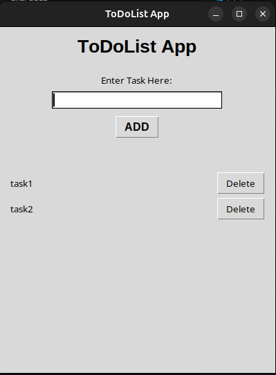

# 📝 To-Do List App using Python & Tkinter

A simple and functional **To-Do List desktop application** built using **Python's Tkinter** library. This app allows users to add, delete, and mark tasks as completed in a clean and interactive interface.

 <!-- Replace with your actual screenshot file path -->

---

## 🚀 Features

- ✅ Add new tasks  
- ❌ Delete selected tasks  
- 📌 Mark tasks as completed  
- 💾 Saves tasks locally (in a text file)  
- 🧼 Clear all tasks  
- 🖥️ Lightweight and easy to use desktop interface

---

## 🛠️ Built With

- [Python](https://www.python.org/)  
- [Tkinter](https://docs.python.org/3/library/tkinter.html) – for GUI

---

## 📦 Installation

1. **Clone the repository:**

   ```bash
   git clone https://github.com/GhazanfarTaqi/ToDoList-App-tkinter.git
   cd todo-tkinter
